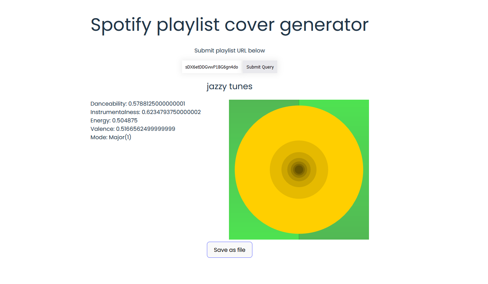

# Spotify playlist cover generator



This is a simple web-based tool for creating Spotify playlist covers. \
The covers are generated by using some of the audio features provided by the Spotify API:
- Danceability
- Energy
- Instrumentalness
- Mode
- Valence

An average is calculated from the tracks included in the playlist.

## Requirements
- NPM: https://www.npmjs.com/

## How to use
- Create a Spotify app: https://developer.spotify.com/documentation/web-api/tutorials/getting-started#create-an-app
- Pull repo
- In `src/script.ts` add your personal client ID and client secret
```
const clientId = "YOUR_CLIENT_ID";
const clientSecret = "YOUR_CLIENT_SECRET";
```
- Install dependencies and run
```
npm install
npm run dev
```
- Visit `http://localhost:5173/` to see the website live

## Technologies used
- NPM
- Vite
- Typescript
- P5.js
- Spotify API

## What I learned
*Blog post about this coming soon...*